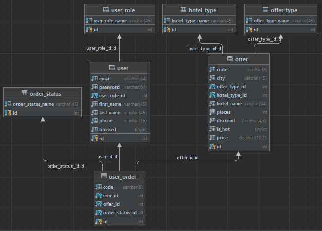

# TASK

The travel agency has a catalog of tours. For the catalog to implement the possibility of

selecting tours:
- by type (rest, excursion, shopping);
- by price;
- by number of persons;
- by hotel type.

  The user registers in the system, selects the Tour and makes the Order. After ordering the
  tour has the status of registered.

  An unregistered user does not have the opportunity to book a tour.

  The user has a personal account, which contains brief information about him, as well as a
  list of selected tours and their current status (registered, paid, canceled).

  The manager defines the tour as hot. Hot tours are always displayed at the top of the list.

  The manager transfers the status of the tour from registered to paid or canceled.
  For each booked tour, a discount is determined with a step set by the manager, but not more than a
  percentage, which is also determined by the manager.

  The system administrator has the same rights as the manager, and can additionally:
- add / delete tour, change tour information;
- block / unblock user.

## DB

- DB model:

- To create schema you can use script in sql/db.sql
- To init variables and fill table you can use script in sql/init_variables.sql

## Instructions for installing and running on a local server (Tomcat)

- Install the JDK at least version 8. Set environment variables for Java.
- Install Maven at least version 3. Set environment variables for Maven.
- Install MySQl at least version 8 and create a 'root' user with the password: 'root'.
- Install Tomcat at least version 9. Open the tomcat-users.xml file in the conf folder (/Tomcat 9.0/conf/tomcat-users.xml). In tomcat-users.xml file after the tag <tomcat-users ...> insert the tag: < user username = "user" password = "pass" roles = "manager-gui, manager-script" /> or replace with the specified tag if <user ...> already exists, save the changes.
- Download mysql-connector-j-8.0.32.jar (https://mvnrepository.com/artifact/com.mysql/mysql-connector-j) and place it in the lib folder (/Tomcat 9.0/lib).
- Run Tomcat (in the bin folder (/Tomcat 9.0/bin/startup.bat) run the startup.bat file or in the Tomcat Monitor run service (Start Service)).
- Download the project (clone via git (https://gitlab.com/drevinskiy.vlad/travel_agency) or download project and unzip).
- Open the Command Prompt (console) from the project folder (travel_agency) or navigate in the Command Prompt to the project folder (travel_agency) where contains pom.xml.
- Execute in the Command Prompt the command: mvn tomcat7:deploy
- When the deployment is complete, go in your browser to http://localhost:8080/travel_agency.
- Register new user
- If you want to change user role, but you don`t have any users with rules of admin then put into db console 'UPDATE user SET user_role_id = ? WHERE email = ?;'. But instead of '?' put your values
- To shut down the system and Tomcat server run the shutdown.bat file in the bin folder (/Tomcat 9.0/bin/shutdown.bat) or stop the service in Monitor Tomcat (Stop Service).
